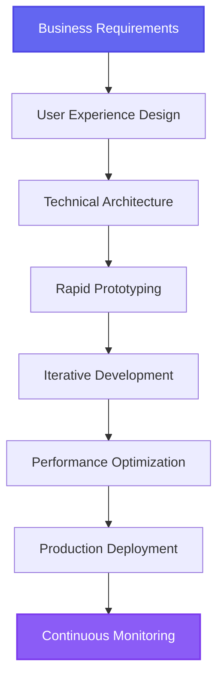

<table align="center">
  <tr>
    <td align="center" width="116">
      <a href="#macropower-tech">
        
      </a>
      <br>Python
    </td>
    <td align="center" width="116">
        
      <br>C++
    </td>
    <td align="center" width="116">
        
      <br>Selenium
    </td>
    <td align="center" width="116">
        
      <br>Django
    <td align="center" width="116">
        
      <br>Tensorflow
    </td>
    </td>
    <td align="center" width="116">
        
      <br>Pytorch
    </td>
    <td align="center" width="116">
        
      <br>Nginx
    </td>
    <td align="center" width="116">
        
      <br>FastAPI
    </td>
    <td align="center" width="116">
        
      <br>Docker
    </td>
  </tr>
  <tr>
    <td align="center" width="116">
        
      <br>JavaScript
    </td>
    <td align="center" width="116">
        
      <br>TypeScript
    </td>
    <td align="center" width="116">
        
      <br>MongoDB
    </td>
    <td align="center" width="116">
        
      <br>Express
    </td>
    <td align="center" width="116">
        
      <br>React
    </td>
    <td align="center" width="116">
        
      <br>NodeJS
    </td>
    <td align="center" width="116">
        
      <br>NextJS
    </td>
    <td align="center" width="116">
        
      <br>Webpack
    </td>
    <td align="center" width="116">
        
      <br>MySQL
    </td>
  </tr>
  <tr>
    <td align="center" width="116">
        
      <br>AWS
    </td>
    <td align="center" width="116">
        
      <br>Github
    </td>
    <td align="center" width="116"> 
        
      <br>Git
    </td>
    <td align="center"  width="116">
        
      <br>Laravel
    </td>
    <td align="center"  width="116">
        
      <br>Rails
    </td>
    <td align="center"  width="116">
        
      <br>HTML5
    </td>
    <td align="center"  width="116">
        
      <br>Bootstrap
    </td>
    <td align="center" width="116">
        
      <br>Tailwind
    </td>
    <td align="center" width="116">
        
      <br>jQuery
    </td>
  </tr>
 <tr>
      <td align="center" width="116">
        
      <br>Go
    </td>
        <td align="center" width="116">
        
      <br>Ruby
      </td>
      </td>
    <td align="center" width="116">
        
      <br>PHP
    </td>
            <td align="center" width="116">
        
      <br>VsCode
    </td>
              <td align="center" width="116">
        
      <br>WordPress
    </td>
              <td align="center" width="116">
        
      <br>Webflow
    </td>
    <td align="center" width="116">
        
      <br>Sass
    </td>
    </td>
    <td align="center" width="116">
        
      <br>GraphQL
    </td>
    <td align="center" width="116">
        
      <br>PostgreSQL
    </td>
 </tr>
</table>


<div align="center">

<div align="center">

# Welcome to My Digital Atelier


</div>

---

## About Me

<table width="100%">
<tr>
<td width="70%">

**George Ionescu** — Senior Full Stack AI Architect crafting digital excellence from Buenos Aires, where passion meets precision and tango meets technology.

I transform complex business challenges into elegant solutions that users love and stakeholders celebrate. While others chase trends, I deliver results that matter.

```javascript
const georgeIonescu = {
  name: "George Ionescu",
  title: "Senior Full Stack AI Architect", 
  location: "Buenos Aires, Argentina 🇦🇷",
  philosophy: "Elegant solutions for real-world problems",
  expertise: ["AI Integration", "3D Web Experiences", "Scalable APIs"],
  approach: "Business impact × Technical excellence",
  promise: "Your success is my mission"
}
```

**What sets me apart:** I speak business fluent, code enterprise-grade, and deliver on time, every time.

</td>
<td width="30%" align="center">


</td>
</tr>
</table>

---

## Technical Expertise

### Frontend Development
<div align="center">

</div>

### Backend & APIs
<div align="center">

</div>

### AI & Data
<div align="center">


</div>

### Databases & Storage
<div align="center">

</div>

---

## Code Showcase

<details>
<summary><strong>AI-Powered FastAPI Backend</strong></summary>

```python
from fastapi import FastAPI, WebSocket, Depends
from openai import AsyncOpenAI
from pydantic import BaseModel
import asyncio

class ChatRequest(BaseModel):
    message: str
    context: str = ""

class SmartAPI:
    def __init__(self):
        self.client = AsyncOpenAI()
        self.app = FastAPI(title="Smart Business API")
        
    async def generate_intelligent_response(self, request: ChatRequest) -> str:
        completion = await self.client.chat.completions.create(
            model="gpt-4",
            messages=[
                {"role": "system", "content": f"Context: {request.context}"},
                {"role": "user", "content": request.message}
            ],
            temperature=0.7
        )
        return completion.choices[0].message.content

api = SmartAPI()

@api.app.post("/chat/")
async def chat_endpoint(request: ChatRequest):
    response = await api.generate_intelligent_response(request)
    return {"response": response, "status": "success"}
```

</details>

<details>
<summary><strong>Interactive 3D React Component</strong></summary>

```jsx
import { Canvas, useFrame } from '@react-three/fiber'
import { OrbitControls, Float, Text } from '@react-three/drei'
import { useRef, useState } from 'react'

function AnimatedCube() {
  const meshRef = useRef()
  const [isHovered, setHover] = useState(false)
  
  useFrame((state, delta) => {
    meshRef.current.rotation.x += delta * 0.3
    meshRef.current.rotation.y += delta * 0.2
  })
  
  return (
    <Float speed={1.5} rotationIntensity={1}>
      <mesh
        ref={meshRef}
        onPointerOver={() => setHover(true)}
        onPointerOut={() => setHover(false)}
        scale={isHovered ? 1.1 : 1}
      >
        <boxGeometry args={[2, 2, 2]} />
        <meshStandardMaterial 
          color={isHovered ? '#6366F1' : '#8B5CF6'} 
          metalness={0.8}
          roughness={0.2}
        />
      </mesh>
    </Float>
  )
}

export default function Scene() {
  return (
    <Canvas camera={{ position: [0, 0, 5] }}>
      <ambientLight intensity={0.5} />
      <pointLight position={[10, 10, 10]} intensity={1} />
      <AnimatedCube />
      <OrbitControls enableZoom={true} />
    </Canvas>
  )
}
```

</details>

---

## Project Results

<table width="100%">
<tr>
<td width="33%" align="center">

**AI Customer Service Bot**

E-commerce platform automation
- 60% reduction in support tickets
- 24/7 intelligent customer assistance
- Integrated with existing CRM

*React • FastAPI • OpenAI • MongoDB*

</td>
<td width="33%" align="center">

**3D Product Configurator**

Interactive furniture customization
- 45% increase in user engagement
- Real-time 3D rendering
- AR preview capabilities

*Three.js • React • WebGL • R3F*

</td>
<td width="33%" align="center">

**Microservices Architecture**

Scalable backend for fintech startup
- Handles 15k+ requests/minute
- 99.9% uptime achievement
- Auto-scaling infrastructure

*Python • FastAPI • PostgreSQL • Docker*

</td>
</tr>
</table>

---

## Performance Standards

<div align="center">

| Metric | Industry Standard | My Delivery |
|--------|------------------|-------------|
| **On-Time Delivery** | ~65% | **98%** |
| **Code Quality** | Variable | **Enterprise Grade** |
| **Client Satisfaction** | Good | **Exceptional** |
| **System Uptime** | 99% | **99.9%+** |

</div>

---

## Development Philosophy

<div align="center">



</div>

**Core Principles:**
- **Business Impact First** — Every line of code should serve a purpose
- **User-Centric Design** — Beautiful experiences that users actually enjoy
- **Scalable Architecture** — Built to grow with your success
- **Clear Communication** — Regular updates in plain language

---

## Why Choose Me

<table width="100%">
<tr>
<td width="50%">

### What I Ask Before We Start
- What does success look like for your business?
- Who will use this system daily?
- How will this scale with your growth?
- What happens during peak usage?

### How I Work
- **Weekly Progress Reports** — Clear updates, no technical jargon
- **Proactive Problem Solving** — Issues identified and resolved early  
- **Flexible Communication** — Buenos Aires timezone, global availability
- **Quality Assurance** — Rigorous testing before any deployment

</td>
<td width="50%">

### What You Get
- **Production-Ready Code** — Enterprise quality from day one
- **Complete Documentation** — Your team can understand and extend
- **Performance Optimization** — Fast, efficient, scalable solutions
- **Ongoing Support** — I'm invested in your long-term success

### My Commitment
- If I say Friday, it ships Friday
- If there's a delay, you know Wednesday why
- Regular demos of working features
- Your success metrics become my success metrics

</td>
</tr>
</table>

---

## GitHub Analytics

<div align="center">


</div>

---

## Let's Create Something Extraordinary Together

<div align="center">

**Ready to transform your boldest vision into digital reality?**

<table width="100%">
<tr>
<td width="50%" align="center">

### 🎯 **My Sweet Spot**
AI-powered web applications  
Immersive 3D experiences  
Complex API orchestrations  
Scalable full-stack architectures  
Interfaces that spark joy

</td>
<td width="50%" align="center">

### 💎 **Investment**
**$40/hour** — Premium quality guaranteed  
Flexible scheduling worldwide  
Rapid prototyping available  
100% satisfaction promise

</td>
</tr>
</table>

### 📬 **Let's Connect**

[](mailto:chain1107saw@gmail.com?subject=Project%20Collaboration)
[](https://t.me/coolman1107)
[](https://discord.com/users/buckler1107)

### 🚀 **Next Steps**

[](mailto:chain1107saw@gmail.com?subject=Let's%20Build%20Something%20Amazing)
[](https://t.me/coolman1107)
[](#)

</div>

---

<div align="center">

### *"I don't just build applications — I architect digital experiences that accelerate business success."*

**George Ionescu • Full Stack AI Architect • Buenos Aires, Argentina**


</div>
