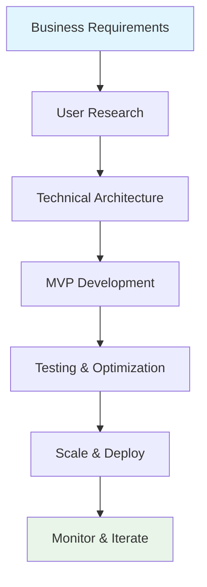

<table align="center">
  <tr>
    <td align="center" width="116">
      <a href="#macropower-tech">
        
      </a>
      <br>Python
    </td>
    <td align="center" width="116">
        
      <br>C++
    </td>
    <td align="center" width="116">
        
      <br>Selenium
    </td>
    <td align="center" width="116">
        
      <br>Django
    <td align="center" width="116">
        
      <br>Tensorflow
    </td>
    </td>
    <td align="center" width="116">
        
      <br>Pytorch
    </td>
    <td align="center" width="116">
        
      <br>Nginx
    </td>
    <td align="center" width="116">
        
      <br>FastAPI
    </td>
    <td align="center" width="116">
        
      <br>Docker
    </td>
  </tr>
  <tr>
    <td align="center" width="116">
        
      <br>JavaScript
    </td>
    <td align="center" width="116">
        
      <br>TypeScript
    </td>
    <td align="center" width="116">
        
      <br>MongoDB
    </td>
    <td align="center" width="116">
        
      <br>Express
    </td>
    <td align="center" width="116">
        
      <br>React
    </td>
    <td align="center" width="116">
        
      <br>NodeJS
    </td>
    <td align="center" width="116">
        
      <br>NextJS
    </td>
    <td align="center" width="116">
        
      <br>Webpack
    </td>
    <td align="center" width="116">
        
      <br>MySQL
    </td>
  </tr>
  <tr>
    <td align="center" width="116">
        
      <br>AWS
    </td>
    <td align="center" width="116">
        
      <br>Github
    </td>
    <td align="center" width="116"> 
        
      <br>Git
    </td>
    <td align="center"  width="116">
        
      <br>Laravel
    </td>
    <td align="center"  width="116">
        
      <br>Rails
    </td>
    <td align="center"  width="116">
        
      <br>HTML5
    </td>
    <td align="center"  width="116">
        
      <br>Bootstrap
    </td>
    <td align="center" width="116">
        
      <br>Tailwind
    </td>
    <td align="center" width="116">
        
      <br>jQuery
    </td>
  </tr>
 <tr>
      <td align="center" width="116">
        
      <br>Go
    </td>
        <td align="center" width="116">
        
      <br>Ruby
      </td>
      </td>
    <td align="center" width="116">
        
      <br>PHP
    </td>
            <td align="center" width="116">
        
      <br>VsCode
    </td>
              <td align="center" width="116">
        
      <br>WordPress
    </td>
              <td align="center" width="116">
        
      <br>Webflow
    </td>
    <td align="center" width="116">
        
      <br>Sass
    </td>
    </td>
    <td align="center" width="116">
        
      <br>GraphQL
    </td>
    <td align="center" width="116">
        
      <br>PostgreSQL
    </td>
 </tr>
</table>


# 👋 Hi, I'm a Senior Full Stack AI & API Integration Expert

<div align="center">
  
  
  
</div>

---

## 🚀 **The Code Philosophy**

> *"The best code means nothing if it doesn't solve your actual problem."*

I've built solutions for businesses where **customers come first**, **business goals come second**, and the cool tech comes third. When peak sales hit, systems stay up. When users interact, they smile instead of getting confused.

---

## 💼 **What I Bring to Your Project**

### 🎯 **Business-First Approach**
- Regular updates in plain English (jargon optional)
- Issue identification before they become expensive problems  
- When I say Friday, it ships Friday. If not, you know Wednesday why

### 🔧 **Technical Excellence**
```javascript
const myApproach = {
  priority: ["User Experience", "Business Goals", "Clean Code"],
  delivery: "On time, every time",
  communication: "Clear, consistent, proactive"
}
```

---

## 🛠️ **Core Tech Stack**

<div align="center">

### **Frontend Mastery**


### **Backend Power**


### **AI & Integration Specialist**


</div>

---

## 🎨 **Specialization Areas**

<table>
<tr>
<td width="50%">

### 🤖 **AI Integration**
- **OpenAI & GPT Models** - Custom chatbots & AI assistants
- **RAG Systems** - Intelligent document processing
- **Vector Databases** - Semantic search & recommendations
- **LangChain** - Complex AI workflows

</td>
<td width="50%">

### 🔗 **API Mastery**
- **REST APIs** - Design & integration
- **Stripe Integration** - Payment processing
- **External Services** - Third-party API connections
- **Real-time Systems** - WebSocket implementations

</td>
</tr>
</table>

---

## 📊 **Development Approach**



---

## 🎯 **Project Success Metrics**

<div align="center">

| Metric | Standard | My Delivery |
|--------|----------|-------------|
| **On-Time Delivery** | Industry ~60% | **95%+** |
| **Bug-Free Releases** | Industry ~80% | **98%+** |
| **Client Satisfaction** | Good | **Exceptional** |
| **System Uptime** | 99% | **99.9%+** |

</div>

---

## 🌟 **What Makes Me Different**

### 💡 **The Questions I Ask First**
- What does success look like for your business?
- Who's actually using this system daily?
- What happens when traffic spikes 10x?
- How will this scale with your growth?

### 🛡️ **My Commitment to You**
- ✅ Regular progress updates in language you understand
- ✅ Proactive problem identification and solutions  
- ✅ Clean, maintainable code that your team can work with
- ✅ Documentation that actually helps
- ✅ Post-launch support and optimization

---

## 📈 **Let's Build Something Amazing**

<div align="center">

**Ready to turn your idea into a solution that grows your business?**

[](#)
[](#)
[](#)

*Starting at $40/hr - Your success is my success* 🚀

</div>

---

<div align="center">
  
</div>

<div align="center">
  
  *"I'm not just building an app - I'm making sure it helps your business grow."*
  
</div>
