```mermaid
graph LR
    A[📋 Requirements] --> B[🎨 Design]
    B --> C[⚡ Develop]
    C --> D[🧪 Test]
    D --> E[🚀 Deploy]
    E --> F[📊 Monitor]
    F --> G[🔄 Optimize]
    
    style A fill:#e1f5fe,stroke:#01579b,stroke-width:2px
    style B fill:#f3e5f5,stroke:#4a148c,stroke-width:2px
    style C fill:#e8f5e8,stroke:#1b5e20,stroke-width:2px
    style D fill:#fff3e0,stroke:#e65100,stroke-width:2px
    style E fill:#fce4ec,stroke:#880e4f,stroke-width:2px
    style F fill:#f1f8e9,stroke:#33691e,stroke-width:2px
    style G fill:#e0f2f1,stroke:#004d40,stroke-width:2px
```

<table align="center">
  <tr>
    <td align="center" width="116">
      <a href="#macropower-tech">
        
      </a>
      <br>Python
    </td>
    <td align="center" width="116">
        
      <br>C++
    </td>
    <td align="center" width="116">
        
      <br>Selenium
    </td>
    <td align="center" width="116">
        
      <br>Django
    <td align="center" width="116">
        
      <br>Tensorflow
    </td>
    </td>
    <td align="center" width="116">
        
      <br>Pytorch
    </td>
    <td align="center" width="116">
        
      <br>Nginx
    </td>
    <td align="center" width="116">
        
      <br>FastAPI
    </td>
    <td align="center" width="116">
        
      <br>Docker
    </td>
  </tr>
  <tr>
    <td align="center" width="116">
        
      <br>JavaScript
    </td>
    <td align="center" width="116">
        
      <br>TypeScript
    </td>
    <td align="center" width="116">
        
      <br>MongoDB
    </td>
    <td align="center" width="116">
        
      <br>Express
    </td>
    <td align="center" width="116">
        
      <br>React
    </td>
    <td align="center" width="116">
        
      <br>NodeJS
    </td>
    <td align="center" width="116">
        
      <br>NextJS
    </td>
    <td align="center" width="116">
        
      <br>Webpack
    </td>
    <td align="center" width="116">
        
      <br>MySQL
    </td>
  </tr>
  <tr>
    <td align="center" width="116">
        
      <br>AWS
    </td>
    <td align="center" width="116">
        
      <br>Github
    </td>
    <td align="center" width="116"> 
        
      <br>Git
    </td>
    <td align="center"  width="116">
        
      <br>Laravel
    </td>
    <td align="center"  width="116">
        
      <br>Rails
    </td>
    <td align="center"  width="116">
        
      <br>HTML5
    </td>
    <td align="center"  width="116">
        
      <br>Bootstrap
    </td>
    <td align="center" width="116">
        
      <br>Tailwind
    </td>
    <td align="center" width="116">
        
      <br>jQuery
    </td>
  </tr>
 <tr>
      <td align="center" width="116">
        
      <br>Go
    </td>
        <td align="center" width="116">
        
      <br>Ruby
      </td>
      </td>
    <td align="center" width="116">
        
      <br>PHP
    </td>
            <td align="center" width="116">
        
      <br>VsCode
    </td>
              <td align="center" width="116">
        
      <br>WordPress
    </td>
              <td align="center" width="116">
        
      <br>Webflow
    </td>
    <td align="center" width="116">
        
      <br>Sass
    </td>
    </td>
    <td align="center" width="116">
        
      <br>GraphQL
    </td>
    <td align="center" width="116">
        
      <br>PostgreSQL
    </td>
 </tr>
</table>


# <div align="center">🚀 Senior Full Stack AI & API Integration Expert</div>

<div align="center">
  
  

</div>

<div align="center">
  
  [](https://yourportfolio.com)
  [](mailto:your@email.com)
  [](https://linkedin.com/in/yourprofile)
  
</div>

---

## <div align="center">💭 **Philosophy**</div>

<div align="center">
  
### *"The best code means nothing if it doesn't solve your actual problem."*

**🎯 Customers First • 📈 Business Goals Second • ⚡ Cool Tech Third**

</div>

<table width="100%">
<tr>
<td width="50%" align="center">

### 🚀 **My Promise**
✅ Friday delivery means Friday delivery<br/>
✅ Clear updates (no tech jargon)<br/>
✅ Problems flagged before they're expensive<br/>
✅ Your growth is my success metric

</td>
<td width="50%" align="center">

### 🎯 **What I Ask First**
❓ What does success look like?<br/>
❓ Who's actually using this?<br/>
❓ What breaks during peak traffic?<br/>
❓ How does this scale with growth?

</td>
</tr>
</table>

---

## <div align="center">🛠️ **Technology Arsenal**</div>

### **🎨 Frontend Excellence**
<div align="center">


</div>

### **⚡ Backend Powerhouse**
<div align="center">


</div>

### **🤖 AI & Intelligence**
<div align="center">


</div>

### **🗄️ Data & Storage**
<div align="center">


</div>

---

## <div align="center">📊 **Performance Metrics**</div>

<div align="center">

```javascript
const myDeliveryStats = {
  onTimeDelivery: "98%",
  clientSatisfaction: "⭐⭐⭐⭐⭐",
  systemUptime: "99.9%+",
  bugFreeReleases: "95%+",
  responseTime: "< 2 hours",
  projectSuccess: "💯"
}
```

</div>

<table width="100%">
<tr>
<td width="33%" align="center">

### 🎯 **Delivery Excellence**
<div align="center">
  

**98% On-Time Delivery**

</div>
</td>
<td width="33%" align="center">

### 🚀 **System Performance**
<div align="center">
  

**99.9% Uptime Guarantee**

</div>
</td>
<td width="33%" align="center">

### 💎 **Code Quality**
<div align="center">
  

**95% Bug-Free Releases**

</div>
</td>
</tr>
</table>

---

## <div align="center">🎨 **Project Showcase**</div>

<table width="100%">
<tr>
<td width="50%">

### 🤖 **AI-Powered Solutions**
```python
# Sample: Intelligent Chatbot Integration
from fastapi import FastAPI
from openai import GPT

app = FastAPI()
ai_engine = GPT(model="gpt-4")

@app.post("/chat")
async def smart_response(query: str):
    return ai_engine.generate_response(
        prompt=optimize_prompt(query),
        context=user_context
    )
```

**Tech Stack:** `Python` `FastAPI` `GPT API` `MongoDB`

</td>
<td width="50%">

### 🎮 **3D Web Experiences**
```jsx
// Sample: Interactive 3D Component
import { Canvas } from '@react-three/fiber'
import { OrbitControls } from '@react-three/drei'

function Scene() {
  return (
    <Canvas>
      <ambientLight intensity={0.5} />
      <InteractiveModel />
      <OrbitControls enableZoom={true} />
    </Canvas>
  )
}
```

**Tech Stack:** `React` `Three.js` `R3F` `Next.js`

</td>
</tr>
</table>

---

## <div align="center">⚡ **Development Workflow**</div>



---

## <div align="center">🌟 **Why Choose Me?**</div>

<table width="100%">
<tr>
<td width="25%" align="center">

### 🎯 **Business Focus**
Your customers' success drives every line of code I write

</td>
<td width="25%" align="center">

### 💬 **Clear Communication**
Regular updates in plain English, issues flagged early

</td>
<td width="25%" align="center">

### 🚀 **Modern Tech Stack**
Cutting-edge tools for future-proof solutions

</td>
<td width="25%" align="center">

### 🎨 **Full-Stack Mastery**
From AI backends to 3D frontends

</td>
</tr>
</table>

---

## <div align="center">📈 **GitHub Analytics**</div>

<div align="center">
  


</div>

<div align="center">
  


</div>

---

## <div align="center">🚀 **Ready to Build Something Amazing?**</div>

<div align="center">

### **Let's turn your vision into reality**

<table>
<tr>
<td align="center">

🎯 **Perfect for:**<br/>
✅ AI-powered web applications<br/>
✅ Complex API integrations<br/>
✅ 3D interactive experiences<br/>
✅ Scalable full-stack solutions

</td>
<td align="center">

💰 **Starting at $40/hr**<br/>
📅 Flexible scheduling<br/>
🚀 Fast turnaround<br/>
💯 100% satisfaction guaranteed

</td>
</tr>
</table>

[](mailto:your@email.com?subject=Project%20Discussion)
[](#)
[](#)

</div>

---

<div align="center">

### 🎨 **"I'm not just building an app - I'm crafting experiences that grow your business"**

<sub>⚡ Full Stack • 🤖 AI Integration • 🎮 3D Web • 📈 Business Growth</sub>


</div></div>
