```mermaid
mindmap
  root((🚀 My Approach))
    🎯 Business First
      Customer Success
      Revenue Impact
      User Experience
      Market Fit
    🛠️ Technical Excellence
      Clean Architecture
      Scalable Code
      Performance
      Security
    💡 Innovation
      AI Integration
      3D Experiences
      Modern Stack
      Future-Proof
    🤝 Communication
      Clear Updates
      No Jargon
      Proactive
      Transparent
```

<table align="center">
  <tr>
    <td align="center" width="116">
      <a href="#macropower-tech">
        
      </a>
      <br>Python
    </td>
    <td align="center" width="116">
        
      <br>C++
    </td>
    <td align="center" width="116">
        
      <br>Selenium
    </td>
    <td align="center" width="116">
        
      <br>Django
    <td align="center" width="116">
        
      <br>Tensorflow
    </td>
    </td>
    <td align="center" width="116">
        
      <br>Pytorch
    </td>
    <td align="center" width="116">
        
      <br>Nginx
    </td>
    <td align="center" width="116">
        
      <br>FastAPI
    </td>
    <td align="center" width="116">
        
      <br>Docker
    </td>
  </tr>
  <tr>
    <td align="center" width="116">
        
      <br>JavaScript
    </td>
    <td align="center" width="116">
        
      <br>TypeScript
    </td>
    <td align="center" width="116">
        
      <br>MongoDB
    </td>
    <td align="center" width="116">
        
      <br>Express
    </td>
    <td align="center" width="116">
        
      <br>React
    </td>
    <td align="center" width="116">
        
      <br>NodeJS
    </td>
    <td align="center" width="116">
        
      <br>NextJS
    </td>
    <td align="center" width="116">
        
      <br>Webpack
    </td>
    <td align="center" width="116">
        
      <br>MySQL
    </td>
  </tr>
  <tr>
    <td align="center" width="116">
        
      <br>AWS
    </td>
    <td align="center" width="116">
        
      <br>Github
    </td>
    <td align="center" width="116"> 
        
      <br>Git
    </td>
    <td align="center"  width="116">
        
      <br>Laravel
    </td>
    <td align="center"  width="116">
        
      <br>Rails
    </td>
    <td align="center"  width="116">
        
      <br>HTML5
    </td>
    <td align="center"  width="116">
        
      <br>Bootstrap
    </td>
    <td align="center" width="116">
        
      <br>Tailwind
    </td>
    <td align="center" width="116">
        
      <br>jQuery
    </td>
  </tr>
 <tr>
      <td align="center" width="116">
        
      <br>Go
    </td>
        <td align="center" width="116">
        
      <br>Ruby
      </td>
      </td>
    <td align="center" width="116">
        
      <br>PHP
    </td>
            <td align="center" width="116">
        
      <br>VsCode
    </td>
              <td align="center" width="116">
        
      <br>WordPress
    </td>
              <td align="center" width="116">
        
      <br>Webflow
    </td>
    <td align="center" width="116">
        
      <br>Sass
    </td>
    </td>
    <td align="center" width="116">
        
      <br>GraphQL
    </td>
    <td align="center" width="116">
        
      <br>PostgreSQL
    </td>
 </tr>
</table>


<div align="center">

# 🌟 Welcome to My Digital Universe 🌟


</div>

<div align="center">


</div>

---

## <div align="center">🎭 **The Human Behind the Code** 🎭</div>

<table width="100%">
<tr>
<td width="30%" align="center">


</td>
<td width="70%">

### 👋 **Hey there, I'm your next favorite developer!**

```javascript
const me = {
  name: "Full Stack AI Wizard",
  location: "🌍 Anywhere with WiFi",
  mindset: "Problems are just puzzles waiting to be solved",
  superpower: "Turning coffee ☕ into production-ready code",
  motto: "Code with purpose, build with passion, deliver with pride",
  funFact: "I debug in my sleep and dream in React components"
}
```

**🎯 My Philosophy:** *"The best code means nothing if it doesn't solve your actual problem."*

</td>
</tr>
</table>

---

## <div align="center">⚡ **The Arsenal of Digital Magic** ⚡</div>

<div align="center">

### 🎨 **Frontend Artistry**


### 🧠 **Backend Brilliance** 


### 🤖 **AI & Intelligence Layer**


### 🗄️ **Data Orchestration**


### 🛠️ **DevOps & Tools**


</div>

---

## <div align="center">🎮 **Live Code Playground** 🎮</div>

<details>
<summary><b>🤖 AI Magic: Intelligent Chatbot Engine</b></summary>

```python
# 🚀 Real AI Implementation I Actually Use
from fastapi import FastAPI, WebSocket
from openai import OpenAI
import asyncio
from typing import Dict, List

class SmartChatbot:
    def __init__(self):
        self.client = OpenAI()
        self.memory: Dict[str, List] = {}
    
    async def generate_response(self, user_id: str, message: str) -> str:
        # Context-aware conversation with memory
        context = self.memory.get(user_id, [])
        
        response = await self.client.chat.completions.create(
            model="gpt-4",
            messages=[
                {"role": "system", "content": "You're a helpful AI assistant"},
                *context,
                {"role": "user", "content": message}
            ],
            temperature=0.7,
            max_tokens=150
        )
        
        # Store conversation for context
        self.memory.setdefault(user_id, []).extend([
            {"role": "user", "content": message},
            {"role": "assistant", "content": response.choices[0].message.content}
        ])
        
        return response.choices[0].message.content

# FastAPI WebSocket endpoint
app = FastAPI()
bot = SmartChatbot()

@app.websocket("/chat/{user_id}")
async def websocket_endpoint(websocket: WebSocket, user_id: str):
    await websocket.accept()
    while True:
        data = await websocket.receive_text()
        response = await bot.generate_response(user_id, data)
        await websocket.send_text(response)
```

</details>

<details>
<summary><b>🎮 3D Web Magic: Interactive React Three Fiber</b></summary>

```jsx
// 🌟 3D Experience I Built for a Client
import { Canvas, useFrame } from '@react-three/fiber'
import { OrbitControls, Text3D, Float } from '@react-three/drei'
import { useRef, useState } from 'react'

function FloatingCodeCube() {
  const meshRef = useRef()
  const [hovered, setHover] = useState(false)
  
  useFrame((state, delta) => {
    meshRef.current.rotation.x += delta * 0.5
    meshRef.current.rotation.y += delta * 0.2
    meshRef.current.scale.setScalar(hovered ? 1.2 : 1)
  })
  
  return (
    <Float speed={2} rotationIntensity={1} floatIntensity={2}>
      <mesh
        ref={meshRef}
        onPointerOver={() => setHover(true)}
        onPointerOut={() => setHover(false)}
      >
        <boxGeometry args={[2, 2, 2]} />
        <meshStandardMaterial 
          color={hovered ? '#00F5FF' : '#FF6B35'} 
          wireframe={hovered}
        />
      </mesh>
    </Float>
  )
}

function Scene() {
  return (
    <Canvas camera={{ position: [0, 0, 5] }}>
      <ambientLight intensity={0.5} />
      <pointLight position={[10, 10, 10]} />
      
      <FloatingCodeCube />
      
      <Text3D
        font="/fonts/helvetiker_regular.typeface.json"
        size={0.5}
        height={0.1}
        position={[0, -3, 0]}
      >
        Interactive 3D Web
        <meshNormalMaterial />
      </Text3D>
      
      <OrbitControls enableZoom={true} />
    </Canvas>
  )
}

export default Scene
```

</details>

<details>
<summary><b>⚡ API Mastery: Production-Ready REST Endpoints</b></summary>

```python
# 🔥 Enterprise-Grade API I Designed
from fastapi import FastAPI, Depends, HTTPException, BackgroundTasks
from pydantic import BaseModel
from sqlalchemy.orm import Session
import asyncio
from typing import Optional, List
import httpx

app = FastAPI(title="Smart Business API", version="2.0.0")

class ProjectRequest(BaseModel):
    title: str
    description: str
    tech_stack: List[str]
    budget: float
    deadline: str
    
class AIAnalysis(BaseModel):
    complexity_score: float
    estimated_hours: int
    risk_factors: List[str]
    recommendations: List[str]

@app.post("/projects/analyze", response_model=AIAnalysis)
async def analyze_project(project: ProjectRequest, background_tasks: BackgroundTasks):
    """
    🤖 AI-powered project analysis
    Analyzes complexity, estimates timeline, identifies risks
    """
    
    # Real AI analysis using GPT
    analysis_prompt = f"""
    Analyze this project:
    Title: {project.title}
    Description: {project.description}
    Tech Stack: {', '.join(project.tech_stack)}
    Budget: ${project.budget}
    
    Provide complexity score (1-10), estimated hours, risks, and recommendations.
    """
    
    # Background task for detailed analysis
    background_tasks.add_task(detailed_project_analysis, project.dict())
    
    # Quick analysis response
    complexity = calculate_complexity(project.tech_stack, project.description)
    
    return AIAnalysis(
        complexity_score=complexity,
        estimated_hours=int(complexity * 10),
        risk_factors=identify_risks(project),
        recommendations=generate_recommendations(project)
    )

async def detailed_project_analysis(project_data: dict):
    """Background processing for comprehensive analysis"""
    # Send to AI service, update database, notify stakeholders
    pass

@app.get("/health")
async def health_check():
    return {"status": "🚀 All systems operational", "uptime": "99.9%"}
```

</details>

---

## <div align="center">📊 **Performance Dashboard** 📊</div>

<table width="100%">
<tr>
<td width="33%" align="center">

### 🎯 **Delivery Excellence**


**98% On-Time Delivery**


*Friday means Friday!*

</td>
<td width="33%" align="center">

### 🚀 **System Performance**


**99.9% Uptime**


*Rock-solid reliability*

</td>
<td width="33%" align="center">

### 💎 **Code Quality**


**95% Bug-Free**


*Clean code is happy code*

</td>
</tr>
</table>

---

## <div align="center">🧠 **My Development Philosophy** 🧠</div>

<div align="center">



</div>

---

## <div align="center">🎨 **What Makes Me Unique** 🎨</div>

<table width="100%">
<tr>
<td width="25%" align="center">


### 🎯 **Business-First Mindset**
I ask the right questions:
- What defines success?
- Who uses this daily?
- How does it scale?
- What breaks at peak load?

</td>
<td width="25%" align="center">


### 🗣️ **Crystal Clear Communication**
- Updates in plain English
- Issues flagged before they're expensive
- Friday delivery means Friday delivery
- Or you know Wednesday why not

</td>
<td width="25%" align="center">


### 🚀 **Cutting-Edge Tech**
- AI-powered everything
- 3D web experiences
- Modern full-stack solutions
- Future-proof architecture

</td>
<td width="25%" align="center">


### 🎨 **Full-Stack Mastery**
- Frontend that wows
- Backend that scales
- AI that thinks
- APIs that connect

</td>
</tr>
</table>

---

## <div align="center">📈 **GitHub Analytics Universe** 📈</div>

<div align="center">


</div>

---

## <div align="center">🌟 **Client Success Stories** 🌟</div>

<table width="100%">
<tr>
<td width="33%" align="center">

### 🤖 **AI Chatbot Platform**
**Challenge:** E-commerce needed 24/7 support  
**Solution:** GPT-powered chatbot with order tracking  
**Result:** 40% reduction in support tickets  

`React` `FastAPI` `OpenAI` `MongoDB`

</td>
<td width="33%" align="center">

### 🎮 **3D Product Configurator**
**Challenge:** Furniture company needed interactive catalog  
**Solution:** Real-time 3D product customization  
**Result:** 60% increase in conversions  

`Three.js` `React` `R3F` `WebGL`

</td>
<td width="33%" align="center">

### ⚡ **Microservices API**
**Challenge:** Startup needed scalable backend  
**Solution:** FastAPI microservices architecture  
**Result:** Handles 10k+ requests/minute  

`Python` `FastAPI` `PostgreSQL` `Docker`

</td>
</tr>
</table>

---

## <div align="center">🚀 **Ready to Build Something Extraordinary?** 🚀</div>

<div align="center">


### **Let's Turn Your Vision Into Digital Reality**

<table width="100%">
<tr>
<td width="50%" align="center">

### 🎯 **Perfect Projects For Me:**
✨ AI-powered web applications  
🎮 Interactive 3D experiences  
🔗 Complex API integrations  
📈 Scalable full-stack solutions  
🤖 Chatbots that actually help  
💫 Apps that make users go "WOW!"

</td>
<td width="50%" align="center">

### 💰 **Investment & Returns:**
🎪 **Starting at $40/hr**  
📅 Flexible scheduling worldwide  
🚀 Rapid prototyping & iteration  
💯 100% satisfaction guarantee  
🎯 Your success = My success  
☕ Fueled by coffee & passion

</td>
</tr>
</table>

[](mailto:your@email.com?subject=Let's%20Build%20Something%20Amazing!)
[](#)
[](#)
[](#)

</div>

---

<div align="center">

### 🎭 **"I don't just write code - I craft digital experiences that make businesses thrive"**


<sub>⚡ **Full Stack Wizard** • 🤖 **AI Whisperer** • 🎮 **3D Artist** • 📈 **Growth Hacker** • ☕ **Coffee Connoisseur**</sub>


**🌈 Made with 💖, ☕, and lots of `console.log()`**

</div>
